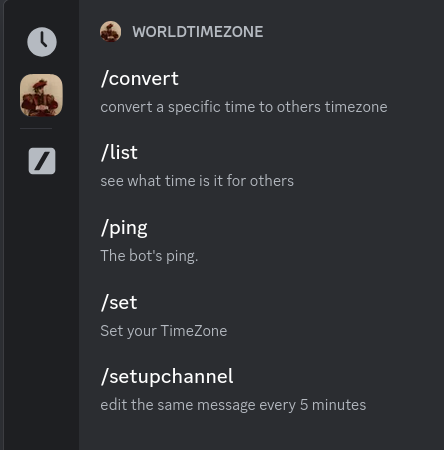
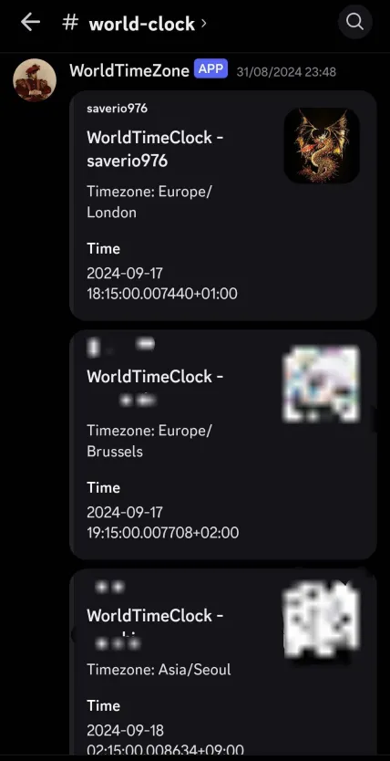

# WorldTimeZone

Display what time is it for your friend in their timezone.

## Usage

This bot use only slash command.

Once you setup a channel for the world clock, WorldTimeZone Bot will send a
message there, and update it every 5 minutes with current time.

## Install

### Download

#### Binary (linux only)

1. Grab a binary for your platform in the latest release
2. Run it with `-e BOT_TOKEN=your.bot.token`

#### Docker (build)

1. Build the [Dockerfile](./Dockerfile)

#### Docker (pull)

1. Pull the image `ghcr.io/x-r-g-b/worldtimezone:main`

### Launch

1. Run it with `-e BOT_TOKEN=your.bot.token` env variable set to your discord bot
2. Run it with `-v path/to/data/folder:/app/.data` where `path/to/data/folder` a folder on your machine (for persistence data)

##### If you have any issues, feel free to create an [issue](https://github.com/X-R-G-B/WorldTimeZone/issues)

##### If you don't want to self-host it, create an issue and I will see if I can send you the link to invit it.
